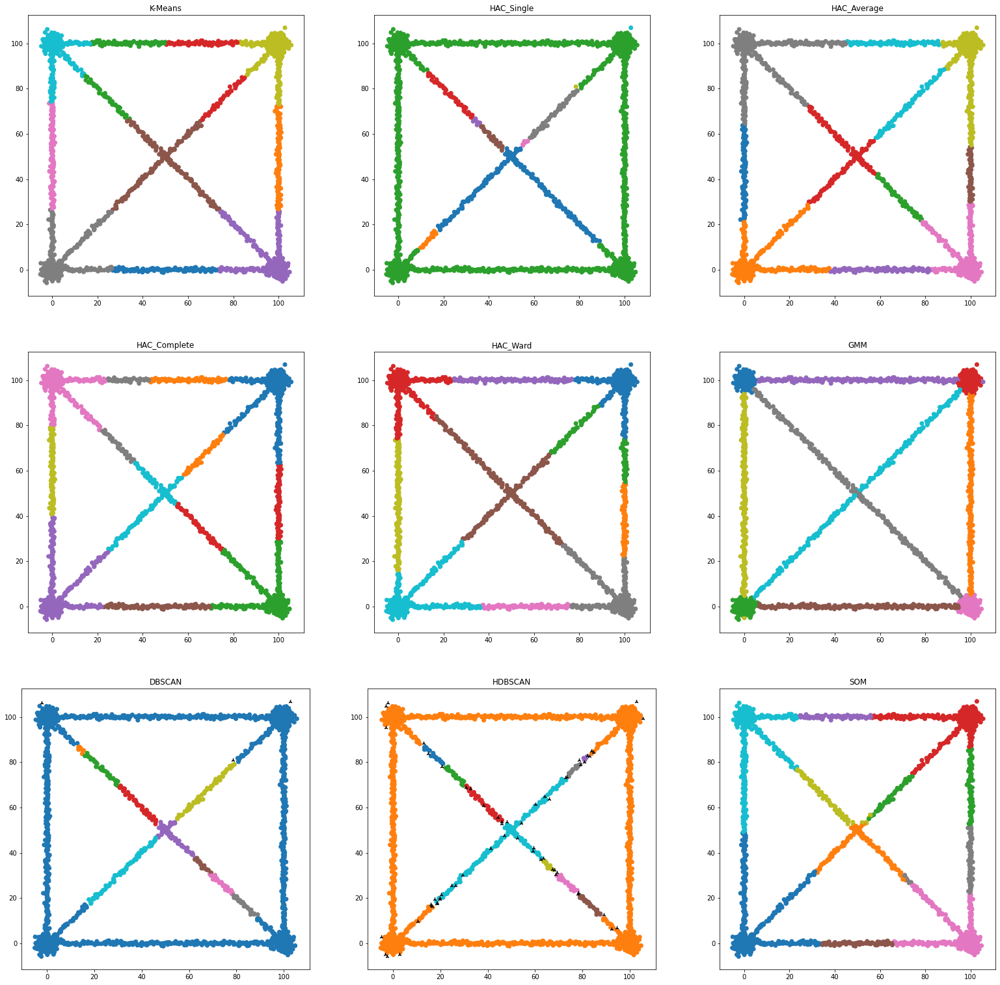

# Machine Learning Course

Projects for the course **Machine Learning** offered by the Master's program in *Data Science and Machine Learning* of the National Technical University of Athens.

The contents of the projects are summarized below:

1. Traffic sign image classification. Unsupervised learning on synthetic datasets.
2. Fake news detection from Twitter posts.

The algorithms used are non deep learning ones.
